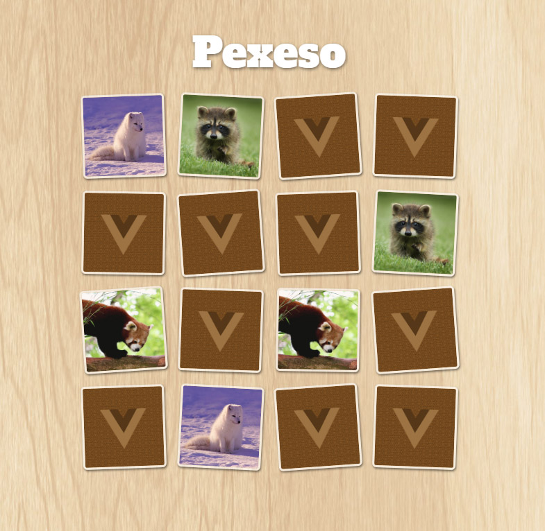

# VUE PEXESO

Vytvoř hru Pexeso a použij k tomu Vue.js.

## CSS

Máš kompletně připravený CSS styl, aby hra vypadala hezky. Stačí do `
` vložit 16 divů, každý div obsahuje 1 obrázek. Je to pexeso, takže ve skutečnosti je to 8 různých obrázků, každý je ve hře dvakrát.

CSS je napsané tak, že se obrázky automaticky seřadí do mřížky 4x4.

Zobrazení kartiček se ovládá přes CSS třídy.

Když je `
` obalující obrázek bez CSS třídy, tak je kartička otočená zadní stranou nahoru. `

`

Když má `
` třídu `otocena`, otočí se kartička obrázkem nahoru a má žlutý okraj.
`

`

Třída `hotovo` taky otočí kartičku obrázkem nahoru, ale ještě zneprůhlední okraj, takže bude vidět, že se k obrázku našel pár a už s ní nejde hýbat.

Třída `spatne` zčervená okraj kartičky - slouží k indikaci, že jsme otočili dva obrázky, které nejsou stejné.

## Co musíme udělat

1. Vymyslet datovou strukturu, ve které budeme uchovávat naši hru. Pravděpodobně půjde o nějaké pole objektů. Co všechno musíme o kartičce uchovávat za informace, aby hra mohla fungovat?

2. Zkusit datovou strukturu z bodu 1 ručně naplnit nějakými daty a upravit HTML šablonu tak, aby vykreslovala kartičky na herní plochu.

3. Vymyslet, jak při startu hry zamícháme kartičky (obrázky). Nejlepší asi bude mít jednoduché pole s názvy obrázků, které máme k dispozici, a z něho při startu hry vygenerovat tu datovou strukturu vymyšlenou v bodu 1.

4. Přidat na kartičky reakci na kliknutí. Voláme nějakou metodu, kterou pracovně v tomto zadání nazvu `tah()`. Při kliknutí kartičku otočíme - přidáme na ni třídu "otocena".

5. Musíme nějak počítat, zda je zatím otočená jenom jedna kartička, nebo zda už druhá.

	 Pokud je to už druhá otočená kartička, musíme ověřit, zda jsou obě kartičky stejné:
	 - jsou stejné = necháme je otočené přidáním třídy `hotovo`
	 - nejsou stejné = vrátíme je zpět do hry, odebereme z nich třídu `otocena`

	 Pozor, když jsou kartičky špatně, tak je nemůžeme otočit zpět rubem nahoru okamžitě. Musíme chvíli počkat, než je otočíme zpátky, aby měl hráč možnost si je prohlédnout. setTimeout?

6. Když jsou všechny kartičky otočené, hra končí.
